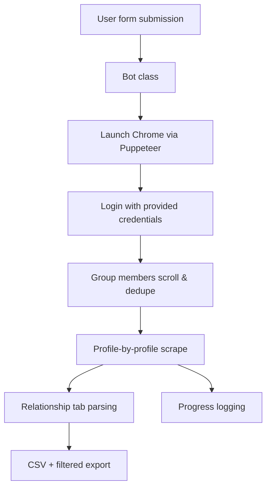

# Facebook Profile Scraper

[](https://nodejs.org/)
[](https://pptr.dev/)
[](#responsible-use)

AI-assisted, browser-automation bot that collects public Facebook group member data (profile names, relationship statuses, profile IDs, and deep links). Built with Puppeteer and Express, it launches a guided UI, logs every action, throttles requests over hours, and exports clean CSVs for analysts, sales teams, and OSINT workflows.

> **TL;DR** – Spin up the UI with `npm start`, feed in group details, and let the bot stream structured relationship data into `profile_data.csv` plus a filtered dataset.


## Why This Scraper Stands Out

- **Group-first workflow** – start from the members tab, auto-dedupe IDs, and respect your target count.
- **Human-like pacing** – distribute visits over the requested hours to keep activity realistic.
- **Full-fidelity browser automation** – launches your installed Chrome for maximum selector compatibility.
- **Structured exports** – produces both raw and filtered CSVs, ready for CRMs or BI tools.
- **Transparent auditing** – rotating log files capture every credential, URL, and status change.
- **One-click desktop builds** – bundled `.exe` binaries for Windows users who prefer no-code setups.


## Quick Start

### 1. Requirements

- Windows 10/11 or macOS/Linux with Chrome installed
- Node.js 18+ (needed if you want to run the source instead of an `.exe`)
- Facebook credentials that can legally access the target group

### 2. Install & Run from Source

```powershell
git clone https://github.com/skyroom07/Facebook-Profile-Scraper.git
cd Facebook-Profile-Scraper
npm install
npm start
```

- The Express server boots on `http://localhost:3000`.
- `index.html` opens automatically, prompting for:
  - `username` / `password`
  - Group members URL
  - Profiles to scrape
  - Hours to spread the run

### 3. Windows Executable Workflow

1. Grab the latest `bot6.x.exe` from the releases folder.
2. Double-click to launch the embedded server + UI.
3. Enter your run parameters, stay logged in to Facebook, and watch the CLI progress bar.

### 4. Outputs

- `profile_data.csv` – cumulative raw data (name, status, profile ID, relationship URL).
- `filtered_profile_data.csv` – same schema minus `"not specified"` rows.
- `logs/log{n}.txt` – timestamped run history for compliance and debugging.

## How It Works



Key routines:

- `scrape_new_urls()` keeps scrolling members until your quota or the DOM bottom is hit.
- `scrape_profiles()` walks every profile, builds `/about_family_and_relationships` URLs, and extracts the most recent non-empty relationship value.
- `save()` writes a clean filtered dataset discarding vague statuses.
- Every run receives a unique log file for traceability.

## Project Structure

```
├─ bot.js                # Express server + Puppeteer workflow
├─ index.html            # Input form served locally
├─ logs/                 # Auto-rotating log files
├─ images/               # Screenshots used in this README
├─ bot*.exe              # Prebuilt Windows binaries
├─ profile_data.csv      # Generated dataset
└─ filtered_profile_data.csv
```

## Roadmap

- [ ] Multi-login rotation with credential vaulting
- [ ] Cloud-ready headless mode using Chrome for Testing
- [ ] Export to Google Sheets and Airtable bases
- [ ] Fine-grained retry logic + Telegram alerts

## Responsible Use

- Scraping Facebook may violate Facebook’s Terms of Service; ensure you have permission and comply with local regulations (GDPR, CCPA, etc.).
- Use only on groups you administer or have written consent to audit.
- Store credentials securely (.env file + secret manager). The repo deliberately excludes `.env` from version control.

## Troubleshooting

| Issue | Fix |
| --- | --- |
| Blank Chrome window | Confirm Chrome is installed at `C:/Program Files/Google/Chrome/Application/chrome.exe` or update `executablePath` in `bot.js`. |
| Login loop | Enable 2FA app passwords or use a test account with fewer security checks. |
| No CSV output | Ensure the bot finished scraping; check `logs/logN.txt` for selector changes and increase wait time. |
| Bot closes instantly | Facebook layout shifts may require fresh selectors; review `meta_data` in `bot.js`. |

## SEO-Friendly Keywords

`facebook profile scraper`, `facebook group data extraction`, `puppeteer automation bot`, `social media osint tool`, `relationship status scraper`, `nodejs web scraping`, `sales intelligence automation`

## Stay Updated

- ⭐ Star the repo if this saves you time.
- 🐞 Open issues for selector updates whenever Meta ships UI changes.
- 💬 Share safe automations & growth stories in discussions.

---

**Need a hosted or team-ready version?** Reach out via issues, and let’s talk about managed deployments and compliance reviews.